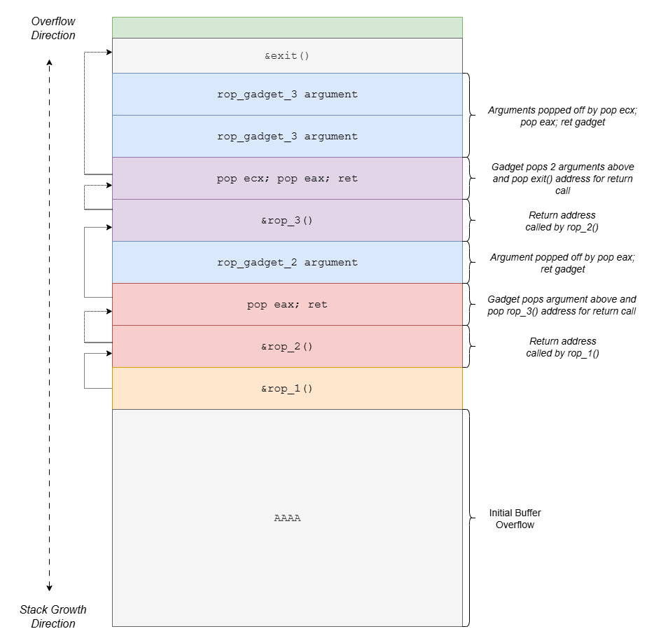

## Data Execution Prevention

DEP (Data Execution Prevention) was introduced to stop code execution in non-code memory regions like the stack and heap. With hardware support (like Intel's NX bit), it marks memory as non-executable.This means even if shellcode is injected, it cannot run from those memory areas (_raise an exception instead_).

### Per-Process DEP
- DEP can be toggled per process at runtime, primarily to avoid breaking older applications.
- A function inside `ntdll.dll` called `LdrpCheckNXCompatibility` checks if DEP should be on.
- It uses `NtSetInformationProcess` to turn DEP on or off for a process dynamically.

## Return Oriented Programming
> _Imagine code execution is like using LEGO blocks. We don’t build new blocks (inject code). Instead, we rearrange existing blocks (gadgets in memory) into a new structure (exploit logic)._

Instead of writing and executing our own malicious code (which DEP would block), we reuse small code snippets already present in memory called "gadgets."

Each gadget:
- Ends in a `RET` (return) instruction.
- Performs a small task (e.g., `POP EAX`, `MOV [ESI], EAX`, `ADD ESP, 4`, etc.).
- Lives in executable regions like DLLs or the main binary.

We then:
- Control the stack via a buffer overflow.
- Chain together gadgets by carefully crafting return addresses.
- Build complex behavior, like calling functions (`VirtualAlloc`, `WinExec`, etc.).

### Sample Flow



### DEP Bypass via Win32 APIs
- VirtualAlloc – Allocates executable memory
- VirtualProtect – Changes memory permissions
- WriteProcessMemory – Injects shellcode into executable memory (e.g., .text section)

Each requires setting up parameters:
- Can’t always hardcode values — so use ROP to set up registers and stack dynamically.

## Win32 VirtualAlloc

`VirtualAlloc` can reserve, commit, or change the state of a region of pages in the virtual address space of calling process. If `lpAddress` points to address belonging to previously committed memory page, we can change the protection setting for that memory page using `flProtect`.

```c
LPVOID WINAPI VirtualAlloc(
    _In_opt_ LPVOID lpAddress,      // Shellcode Address
    _In_ SIZE_T dwSize,             // Number of bytes to allocate
    _In_ DWORD flAllocationType,    // Type of allocation (e.g., MEM_COMMIT | MEM_RESERVE)
    _In_ DWORD flProtect            // Memory protection (e.g., PAGE_EXECUTE_READWRITE)
);
```


```
VirtualAlloc Skeleton
0d2be300 75f5ab90 -> KERNEL32!VirtualAllocStub
0d2be304 0d2be488 -> Return address             (shellcode return address to return to after VirtuallAlloc call)
0d2be308 0d2be488 -> lpAddress                  (shellcode address)
0d2be30c 00000001 -> dwSize                     (0x1)
0d2be310 00001000 -> flAllocationType           (MEM_COMMIT - 0x00001000)
0d2be314 00000040 -> flProtect                  (PAGE_EXECUTE_READWRITE - 0x00000040)
```

## Win32 VirtualProtect

`VirtualProtect` changes the protection on a region of committed pages in the virtual address space of the calling process.

```c
BOOL WINAPI VirtualProtect(
    _In_  LPVOID lpAddress,           // Shellcode address
    _In_  SIZE_T dwSize,              // Size of region to change
    _In_  DWORD flNewProtect,         // New protection flags (e.g., PAGE_EXECUTE_READWRITE)
    _Out_ PDWORD lpflOldProtect       // Pointer to variable that receives old protection
);
```

```
VirtualProtect Skeleton
0d2be300 75f5ab20 -> KERNEL32!VirtualProtect
0d2be304 0d2be488 -> Return address             (shellcode return address to return to after VirtualProtect call)
0d2be308 0d2be488 -> lpAddress                  (same as above)
0d2be30c 00000001 -> dwSize                     (size of shellcode - ~0x300)
0d2be310 00000040 -> flNewProtect               (PAGE_EXECUTE_READWRITE - 0x00000040)
0d2be314 0d2be47C -> lpflOldProtect             (some writable memory address)
```
> _`lpflOldProtect` must point to a writable memory region to store the result._

## Win32 WriteProcessMemory


```c
BOOL WINAPI WriteProcessMemory(
    _In_  HANDLE  hProcess,                 // Handle to process (usually -1 for current / GetCurrentProcess())
    _In_  LPVOID  lpBaseAddress,            // Address to write to
    _In_  LPCVOID lpBuffer,                 // Pointer to buffer with data
    _In_  SIZE_T  nSize,                    // Size of data to write
    _Out_ SIZE_T  *lpNumberOfBytesWritten   // Optional: number of bytes written
);
```

```
0d2be300 75f5b010 -> KERNEL32!WriteProcessMemory
0d2be304 0d2be488 -> Return address                 (shellcode return address to return to after WriteProcessMemory call)
0d2be308 ffffffff -> hProcess                       (pseudo Process handle)
0d2be30c 0d2be488 -> lpBaseAddress                  (Code cave address)
0d2be310 0d2be400 -> lpBuffer                       (shellcode address)
0d2be314 00000010 -> nSize                          (size of shellcode)
0d2be318 00000000 -> lpNumberOfBytesWritten         (writable memory address, i.e. !dh -a MODULE / NULL if unused)
```

## Useful Tricks to Avoid Null Bytes
> **_Techniques used to avoid null bytes are not limited to the following! It is limited by our creativity!_**

_Using the example of Win32 VirtualAlloc, we discuss some key tricks to avoid Null Bytes._

### 1️⃣ lpAddress = shellcode location
_Issue: Shellcode address must be loaded dynamically, using relative addressing (avoid nulls)._

✅ Trick Used:
```
SUB EAX, 0xfffffdf4  ; (i.e., simulate EAX += 0x20C)
```

> ✅ Why this avoids nulls: 0xfffffdf4 (–0x20C) avoids 0x00 bytes and achieves the desired result via subtraction.

### 2️⃣ dwSize = 0x1
_Issue: Encoding 0x00000001 directly introduces null bytes._

✅ Trick Used:
- Load 0xFFFFFFFF into EAX, then apply:
```
NEG EAX ; → EAX = 0x00000001
```
> ✅ Why this avoids nulls: 0xFFFFFFFF and the result of NEG both contain no null bytes in immediate values or instructions.

### 3️⃣ flAllocationType = 0x1000
_Issue: Using NEG to get 0x1000 would require 0xFFFFF000, which contains nulls._

✅ Trick Used:
- Used addition of two null-free values:
```
EAX = 0x80808080
ECX = 0x7F7F8F80  ; so EAX + ECX = 0x1000
ADD EAX, ECX
```
> ✅ Why this avoids nulls: Carefully selected constants are null-free and can be added to produce the desired result.

### 4️⃣ flProtect = 0x40
Issue: Directly using 0x00000040 → null bytes.

✅ Trick Used:
- Same ADD trick:
```
EAX = 0x80808080
ECX = 0x7F7F7FC0 ; so EAX + ECX = 0x40
ADD EAX, ECX
```
> ✅ Why this avoids nulls: Again, chosen constants avoid nulls and produce target value via math.