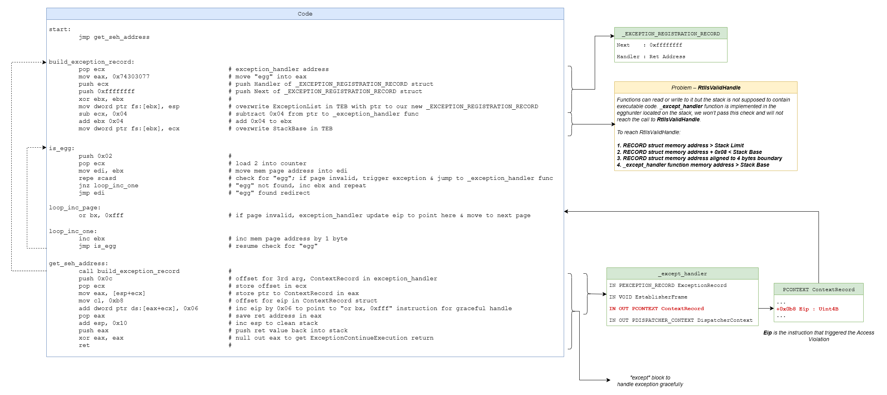

## What is Egg Hunting?
Egg hunting is a technique used to locate the actual payload (shellcode) in memory. 

> *Basically it uses a small custom shellcode to seek out our final shellcode in memory.*

The **"egg"** refers to a unique marker, often a sequence of bytes, placed just before the actual shellcode payload.

>```"w00tw00t" + <actual shellcode>```

## Why Egg Hunting?
Sometimes, we might be able to inject a large payload (*i.e. Metasploit revershell payload*) into memory, but we only control a very small execution space (*too small to fit the full shellcode*). In this case, egg hunting helps us to bypass this issue.

## How to Egg Hunt?
### Conditions For Egg Hunting
There are 3 conditions for "Egg Hunting" to work.  
1. Must be able to jump to and execute "staged" shellcode (*egg hunter*). The "staged" egg hunter must be available in a predictable memory location, so as to allow for reliable jumping and execution.
2. Final shellcode must placed in memory (*i.e. Stack/Heap*)
3. Final shellcode must be prepended with a unique sequence of bytes (**_"egg"_**).


### Egg Hunting using SEH

1. Inject payload: [ egg ("w00tw00t") + shellcode ] somewhere in memory
2. Overflow buffer and overwrite SEH
3. Place egghunter shellcode after SEH
4. Trigger exception → OS jumps to SEH → executes egghunter
5. Egghunter searches memory for egg
6. Egghunter finds marker and jumps to shellcode
7. Payload runs

