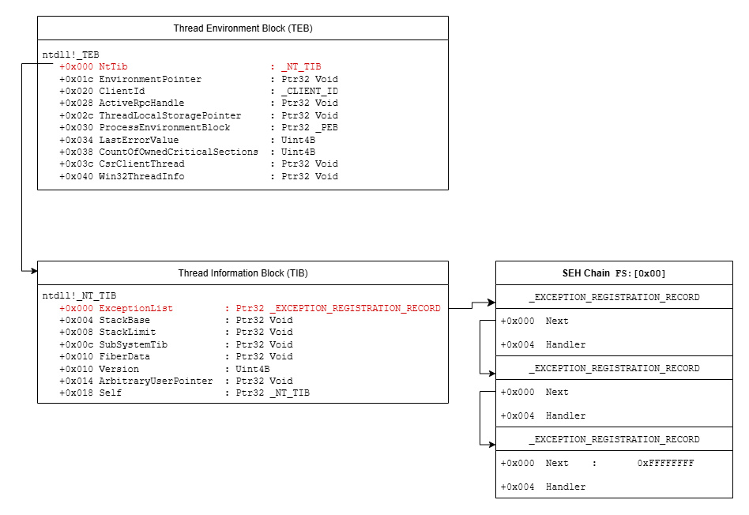
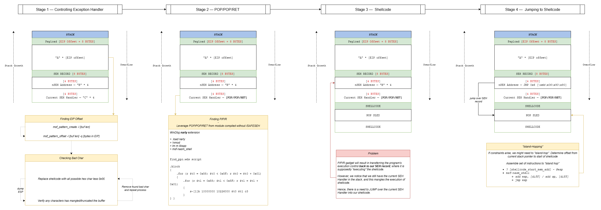

## What is SEH (Structured Exception Handling) ?

Structured Exception Handling (SEH) is a Windows mechanism that handles  exceptions (i.e. access violations or illegal instructions), catching them and resolving them.  

### How it works (_briefly_)

When a program runs, the OS maintains a linked list of **exception handler records** on the stack. 

Each exception handler record has the following struct

```C
struct _EXCEPTION_REGISTRATION_RECORD {
    struct _EXCEPTION_REGISTRATION_RECORD *Next;   
    PEXCEPTION_HANDLER Handler;
};
```

When an exception occurs:
- OS traverses through the SEH chain and tried to find appropriate exception `Handler`
- `Handler` decides to handle the exception or pass it up
- If no suitable `Handler` found, default OS `Handler` is used (_last record on SEH chain_) 

SEH works on a per-thread level. Each thread in a program can be identified by the _Thread Environmental Block_ (TEB). 

The SEH chain is store in TEB in its first member called _Thread Information Block_ (TIB). The list head is stored in **FS:[0x00]** segment register (_in Win32_).

> **_NOTE: In 32-bit applications, if module is compile with SafeSEH flag, linker will produce a table of safe exception handlers._**



## SEH Exploitation

### SEH Attack Flow
1. Force program to throw exception (_via BOF_)
2. Trigger SEH Handler, which is overwritten with memory address in program containing `POP POP RET` gadget 
3. `POP POP RET` gadget forces program to jump to `nSEH`, which contains a short jump to shellcode
4. Should constraints arise (_i.e. memory misalignment etc_), perform "island-hopping" to jump to shellcode
5. Shellcode execution 

